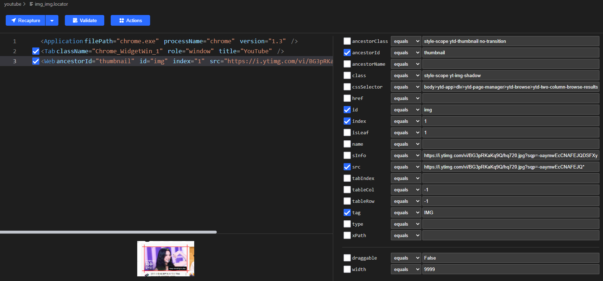
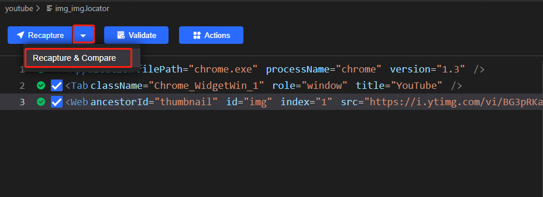
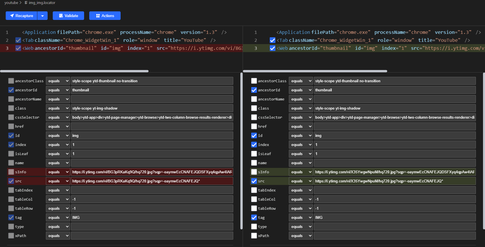
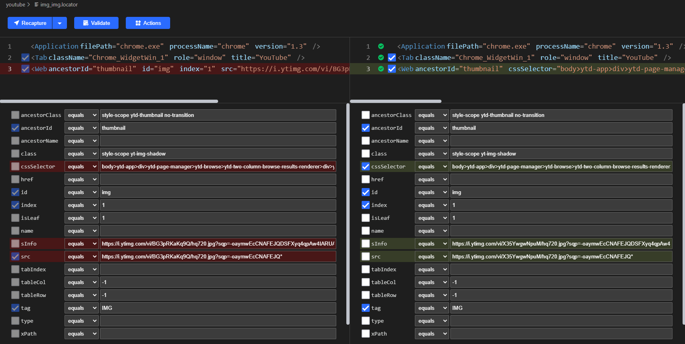

# Recapture & Compare

## Version Requirement
[Clicknium Visual Studio Code Extension](https://marketplace.visualstudio.com/items?itemName=ClickCorp.clicknium) >= 0.1.9

[Clicknium Python Module](https://pypi.org/project/clicknium/) >= 0.1.8

## Overview

Recapture & Compare allows you to recode the same UI element, create a new location, and present the user with a comparable view.
The user may easily distinguish the dynamic attributes by comparing the new locator to the prior one. The chosen list should not include these dynamic attributes.

Many websites today include dynamic pages, which means that when a user opens the same page, different material is shown. Locating the element will be challenging in this scenario. The element's locator was successfully located the previous time, and it might be failed located the next time. . Use the "Recapture and Compare" feature to rapidly decide which properties on the locator should be used in this situation.

The example below demonstrates how to make advantage of this functionality.

Case background: From the YouTube main page, the user wants to download the first video cover image.

- It is simple to generate the locator like the one below using Clicknium Recorder:

- When you validate the location after refreshing the web page, it may fail because the image has changed.

- Let us use 'Recapture and Compare' to recapture the first image again.

You will get the following view:

As you can see from the comparative mode, the values of the attributes "src" and "sInfo" have changed, so we should disregard them and choose different attributes.

You can uncheck "src" and check "cssSelector" in this situation, then save locator.

Compared to the old locator, the new one ought to be more reliable.