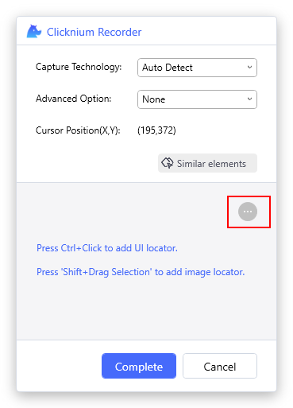
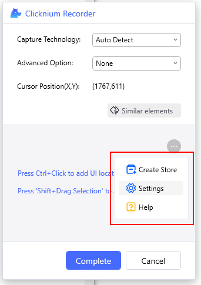
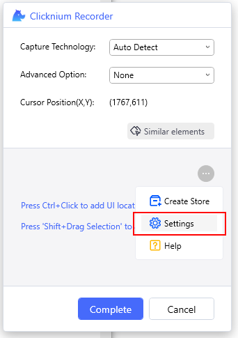
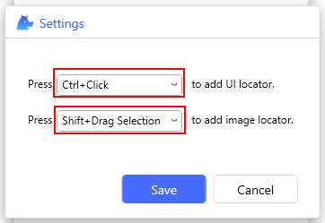
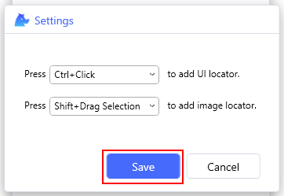

# Settings

## Version Requirement
[Clicknium Visual Studio Code Extension](https://marketplace.visualstudio.com/items?itemName=ClickCorp.clicknium) >= 0.1.9

[Clicknium Python Module](https://pypi.org/project/clicknium/) >= 0.1.9

## Overview

Support for setting up a shortcut key for image and UI locator capture. 

## Setting Steps

- Find `LOCATORS` tab and click the button `Capture` as follows:  
&emsp; 

- The Recorder window pops up as below:  
&emsp;    

- Click the `...` button to open the menu list.  
&emsp;  

- The menu list as below:  
&emsp;  

- Click the `Settings` button to open the Settings window.  
&emsp;  

- Select your own shortcut key.  
&emsp;  

- Click the `Save` button to save your settings.  
&emsp;  

- Use the new shortcut for capturing.  