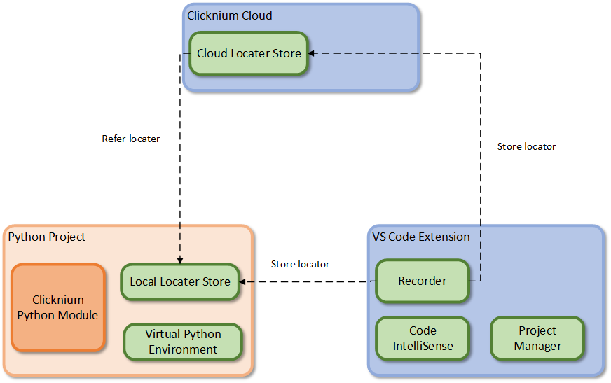

# Tutorial
This tutorial walks you through some of the fundamental Clicknium concepts, tools, and their usage while writing your first automation code.

# Installation
An Clicknium installation generally consists of the following components:
- [Clicknium Python Package](./../quickstart.md#install-clicknium-python-package): Clicknium automation core module. It provides the API for UI automation.   
- [Clicknium VS Code Extension](./../quickstart.md#setup-clicknium-visual-studio-code-extension): Set up the development tool for coding automation script.
- [Clicknium Automation Extension](./../concepts/extensions/extensions.md): To get better performance, Clicknium provides some extension targeted to different environment and senario. Developers can install extension accroding to their need.  
Please follow [Quick Start](./../quickstart.md) to finish the installation.

# Clicknkum Architecture Overview 
Clicknium is a platform that lets you build your automation code. Clicknium Python Module will help to init ***Local Locator Store*** and ***Virtual Python Environment***. ***The VS Code Extension*** provides the Recorder to capture locaters and store it into Cloud/Local locater store. It also supports Code InteliSense to give a seamlessly coding experience. The Clicknium Cloud gives a chance to save and manage locators in cloud and share it cross projects/machines.  

# Clicknium Workflow
[Clicknium Recorder](./../concepts/recorder/recorder.md) can help you to capture UI element that you want to automate. After a successful capture, the recorder will generate a [Clicknium Locator](./../concepts/locator.md) target to the UI element and the locator will be send and store in [Clicknium Locator Store](./../concepts/locatorstore.md). You can create a [Clicknium Project](./../concepts/clickniumproject.md) to wirte your Python code. In the code, you can refer the locators stored in the Locator Store and operate via automation API provided by Clicknium Python Module.  
